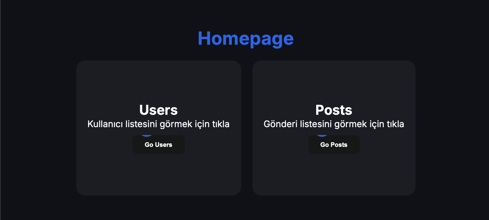
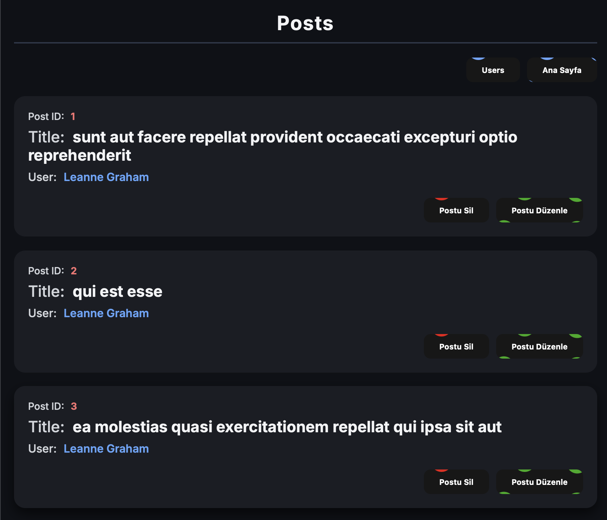
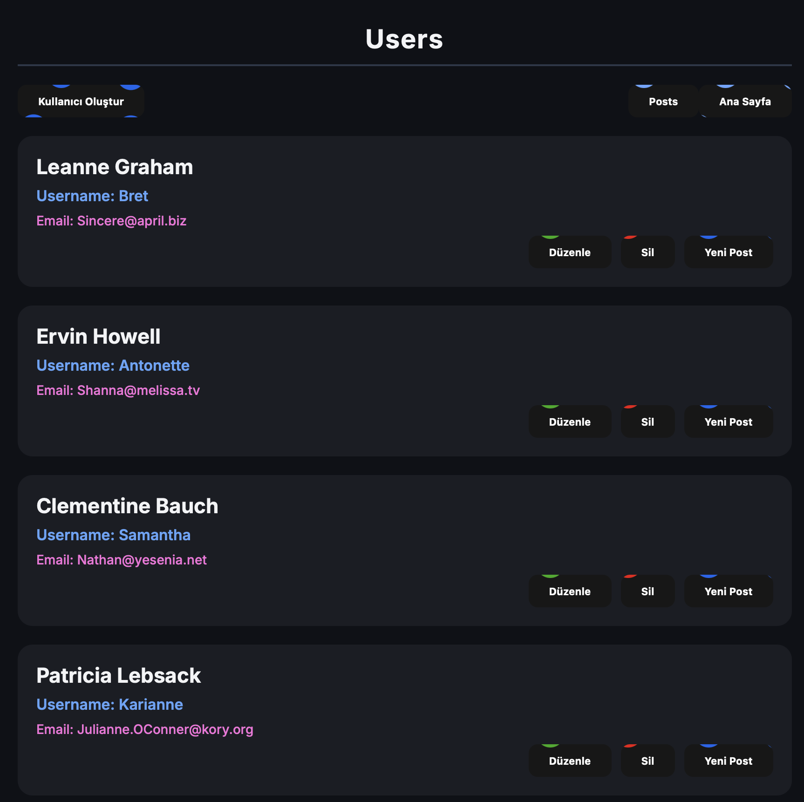

# DaVinci Board Game Frontend Projesi

Bu proje, **DaVinci Board Game** iş başvurusu amacıyla geliştirilmiş bir frontend uygulamasıdır.  
Proje, kullanıcı ve post bilgilerini çekme ve bu bilgiler üzerinde **CRUD (Create, Read, Update, Delete)** işlemleri yapabilme yeteneğine sahiptir.

## Demo
[Canlı Demo](https://da-vinci-board-game.vercel.app/)





## Özellikler
- Kullanıcı bilgilerini görüntüleme
- Post bilgilerini görüntüleme
- Kullanıcı ve post verileri üzerinde **CRUD (Create, Read, Update, Delete)** işlemleri yapabilme
- Basit ve kullanıcı dostu arayüz

## Kurulum
1. Depoyu klonlayın
```bash
git clone https://github.com/Ozaui/DaVinciBoardGame.git
```

2. Proje dizinine girin
```bash
cd da-vinci
```

3. Bağımlılıkları yükleyin
```bash
npm install
```
veya
```bash
yarn install
```

4. Uygulamayı çalıştırın
```bash
npm start
```
 veya
```bash
yarn start
```

## Teknolojiler
- React.js
- Redux Toolkit
- React-Router-DOM
- Axios
- ESLint

# Önemli Not: Bu proje, module CSS kullanılarak geliştirilmiştir. Ancak, Bootstrap, Tailwind CSS gibi CSS framework’leriyle de geliştirilebilecek yetkinliğe sahibim. İstenildiği takdirde proje bu framework’ler kullanılarak revize edilebilir.
